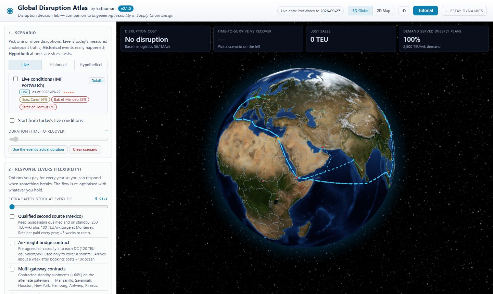
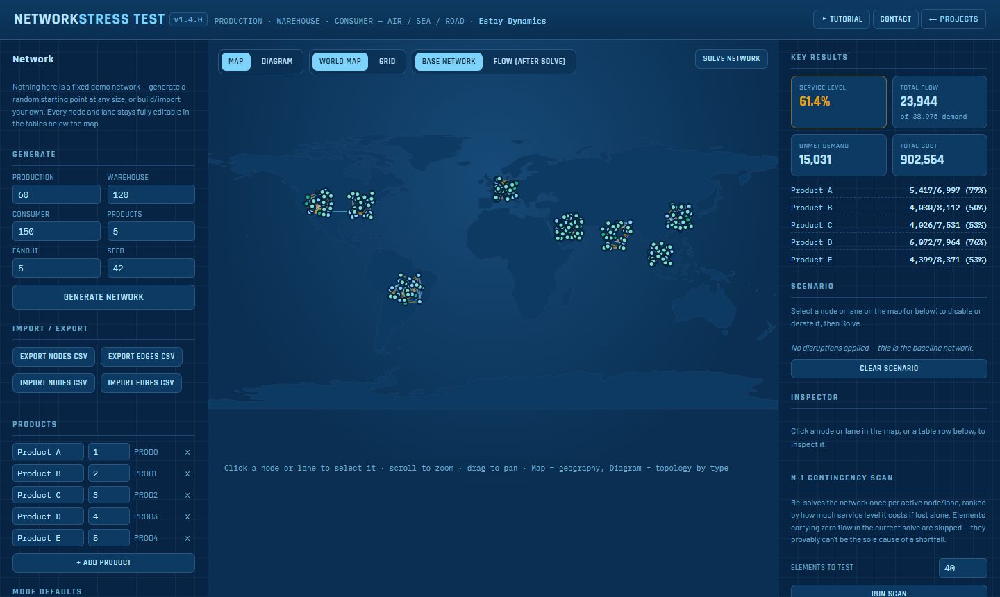
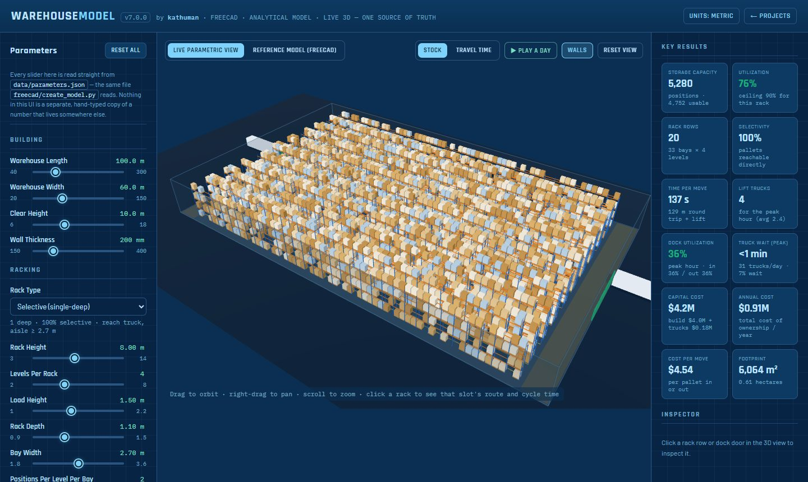
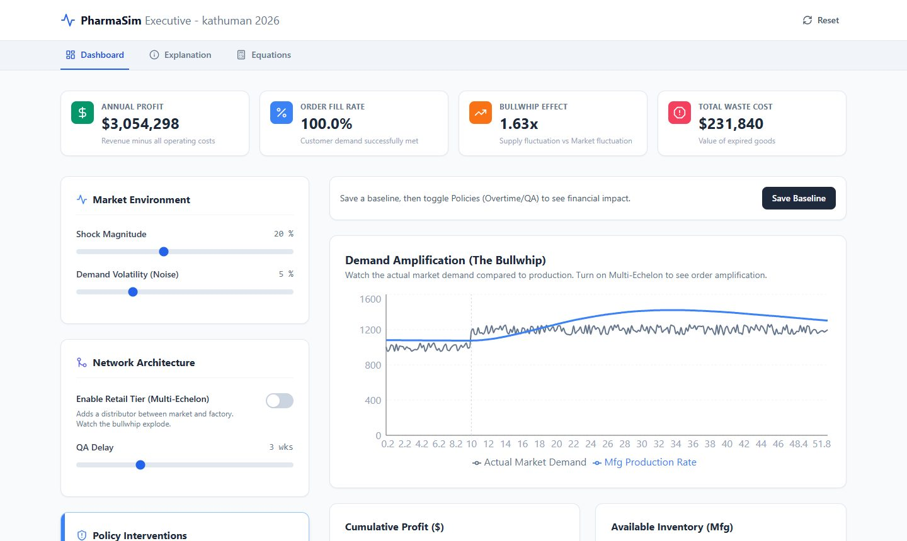
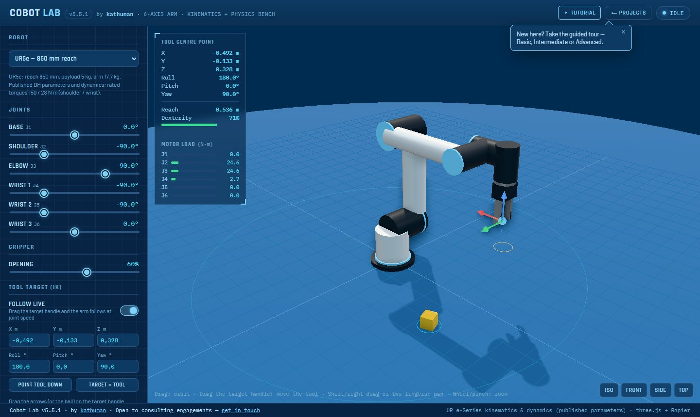

<picture>
  <source media="(prefers-color-scheme: light)" srcset="assets/banner-light.png?v=3">
  
</picture>

PhD, Technical University of Denmark (DTU) · MSc, MIT · Council member, System Dynamics Society · Copenhagen

I help organisations understand how disruptions travel through their supply networks and design networks
that absorb them — and I build the models as interactive tools, so decisions can be explored rather than
read off a slide.

## Areas of expertise

- **[Systems analysis](https://kathuman.github.io/estay-dynamics/expertise/systems-analysis.html)** — system dynamics and systemic risk analysis: why problems recur after every fix, how far disruptions travel through a network, and how much flexibility (buffers, second sources, alternative routes) it pays to hold; causal loop diagrams, stock-and-flow simulation, group model building and executive workshops
- **[Network design optimisation](https://kathuman.github.io/estay-dynamics/expertise/network-design-optimization.html)** — MILP and stochastic programming for facility, sourcing and capacity decisions, stress-tested by Monte Carlo
- **[Real options](https://kathuman.github.io/estay-dynamics/expertise/real-options.html)** — the value of deferring, staging or abandoning a network investment under uncertainty
- **[Simulation and digital twins](https://kathuman.github.io/estay-dynamics/expertise/simulation-digital-twins.html)** — discrete-event, agent-based and Monte Carlo models that test warehouse, production and network changes before capital is committed
- **[Maritime and cyber-physical risk](https://kathuman.github.io/estay-dynamics/expertise/maritime-cyber-physical-risk.html)** — how fast detection and response must be to keep a cyber incident in ship or port systems from becoming a physical loss
- **[Engineering simulation](https://kathuman.github.io/estay-dynamics/expertise/engineering-simulation.html)** — validated physics models for concept and feasibility decisions: fluid flow and forces (CFD), robotic cell reach and cycle times, mechanism dynamics, parametric CAD

Sector experience: mining, beverage distribution, healthcare and pharmaceutical manufacturing.

## Featured work

<table>
<tr>
<td width="50%" valign="top">

<b><a href="https://kathuman.github.io/estay-dynamics/atlas/">Global Disruption Atlas</a></b> — a disruption decision lab on a 3D globe:
live chokepoint conditions, historical and hypothetical disruptions, and response levers (safety stock,
second sources, air bridges) priced against time-to-survive and time-to-recover. A companion to
<i>Engineering Flexibility in Supply Chain Design</i>.
</td>
<td width="50%" valign="top">

<b><a href="https://kathuman.github.io/claude-projects/network-stress-test/web/">Network Stress Test</a></b> — a supply-network resilience sandbox:
hundreds of editable nodes, a min-cost-flow solver, N-1 contingency scans, Monte Carlo stress tests and
adversarial worst-case search.
</td>
</tr>
<tr>
<td width="50%" valign="top">

<b><a href="https://kathuman.github.io/claude-projects/warehouse-model/web/">Warehouse Model</a></b> — warehouse design from first principles:
a parametric FreeCAD model and an analytical model share one layout (proved identical on 400 designs),
with simulation, total cost of ownership, an optimiser, and IFC / DXF / glTF export.
</td>
<td width="50%" valign="top">

<b><a href="https://kathuman.github.io/pharma-sim/">PharmaSim</a></b> — a system-dynamics simulator of a pharmaceutical supply chain:
the bullwhip effect, multi-echelon amplification, QA quarantine and expiry, and policy levers with their
trade-offs, measured against a baseline.
</td>
</tr>
<tr>
<td width="50%" valign="top">

<b><a href="https://kathuman.github.io/claude-projects/tube-flow-sim/">Tube Flow</a></b> — 3D lattice-Boltzmann CFD on the GPU: spheres, STL
shapes and wing sections, validated against exact solutions and published data, with a grid-convergence
study in its <a href="https://kathuman.github.io/claude-projects/tube-flow-sim/validation.html">validation report</a>.
</td>
<td width="50%" valign="top">

<b><a href="https://kathuman.github.io/claude-projects/cobot-lab/">Cobot Lab</a></b> — Universal Robots arms from their published parameters:
inverse kinematics, timed motion, path planning around obstacles, physics with pick &amp; place, URScript
export and a ROS bridge.
</td>
</tr>
</table>

## Verification and validation

Each model is checked against an independent reference before it is used: the CFD solver against Hagen–Poiseuille flow, the Haberman–Sayre
wall-corrected Stokes drag and Johnson &amp; Patel's sphere wakes; the robot kinematics on 1,600+ checks;
the warehouse layout against an independent FreeCAD model; the chess rules by perft against published move counts, with every course exercise checked by Stockfish and the endgame tablebase. The suites run in CI:

## Research and consulting

- **[Estay Dynamics](https://kathuman.github.io/estay-dynamics/)** — my consulting practice: system dynamics and network optimisation for supply chains ([repo](https://github.com/kathuman/estay-dynamics))
- **[DDRA — dynamic cyber-risk model](https://kathuman.github.io/estay-dynamics/ddra/)** — a five-stock system-dynamics model of the attack–defence loop in a ship's cyber-physical ballast system: detection delay decides containment or failure
- **[Flexibility in Supply Chain](https://kathuman.github.io/Book-Flexibility-in-SC/)** — companion tools for the book ([repo](https://github.com/kathuman/Book-Flexibility-in-SC))
- **[Supply Chain Digital Twin](https://github.com/kathuman/supply-chain-digital-twin)** — capacity under a months-on-hand stock policy and end-to-end lead time across a multi-tier network (Streamlit)
- **[Pharma supply chain ABM](https://github.com/kathuman/pharma-supply-chain-abm)** — an agent-based model of material through a CMO chain (Mesa, Streamlit)
- **[System dynamics models](https://github.com/kathuman/Vensim-Experiments)** — Vensim models in public health, epidemiology and cyber-resilience

## Selected projects

<!-- PROJECTS:START -->
Further tools and experiments, newest first. The full list of 17 is on the [projects site](https://kathuman.github.io/claude-projects/).

| Project | What it is | |
|---|---|---|
| [Plumb](https://kathuman.github.io/claude-projects/balancebot-sim/) | A 3D simulator for a two-wheeled balancing robot (v1.2). | [code](https://github.com/kathuman/claude-projects/tree/main/balancebot-sim) |
| [Face Morph](https://kathuman.github.io/claude-projects/face-morph/) | Live face-landmark detection and triangulated face morphing, entirely on-device. | [code](https://github.com/kathuman/claude-projects/tree/main/face-morph) |
| [Network Design Visuals](https://kathuman.github.io/claude-projects/supply-chain-viz/) | A browsable library of 17 supply-chain network-design visualizations, ordered simple → advanced: demand bars, cost-to-serve stacks, O–D flow maps, an… | [code](https://github.com/kathuman/claude-projects/tree/main/supply-chain-viz) |
| [Scientific Calculator](https://kathuman.github.io/claude-projects/scientific-calculator/) | A keyboard-friendly scientific calculator with a real recursive-descent expression parser (no eval), DEG/RAD/GRAD modes, memory, inverse trig via a 2nd key,… | [code](https://github.com/kathuman/claude-projects/tree/main/scientific-calculator) |
| Problem Log (Android) | A native Android app that turns a spoken or typed problem description into a structured record — title, summary, category, short-term mitigation, long-term… | [code](https://github.com/kathuman/claude-projects/tree/8b96c8b66ac28f037989d78b0b1d251bbae5e5c3/problemlog-android) |
| [Real Options for Network Design](https://kathuman.github.io/claude-projects/real-options/) | An interactive explainer for real options applied to supply chain network design. | [code](https://github.com/kathuman/claude-projects/tree/main/real-options) |
<!-- PROJECTS:END -->

---

Open to consulting engagements — [get in touch](https://kathuman.github.io/estay-dynamics/contact.html).
